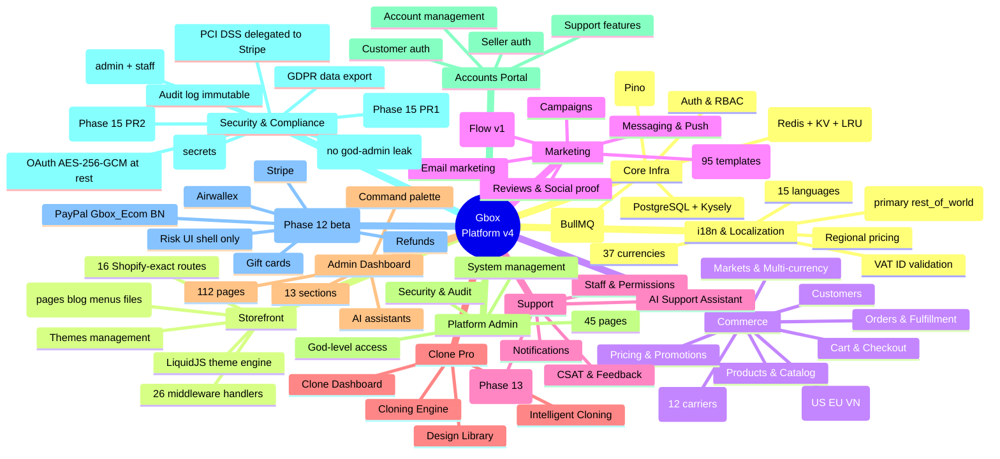
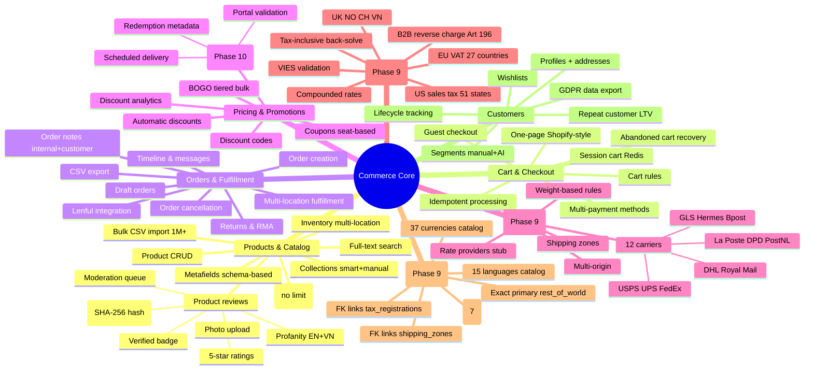
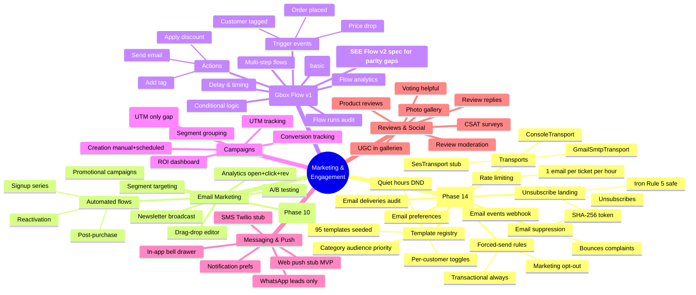
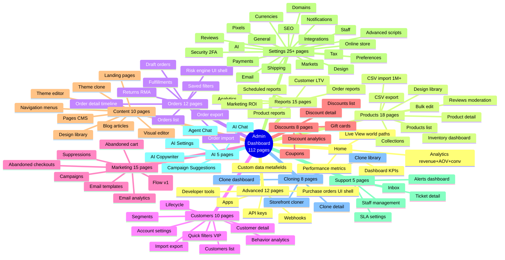

# Gbox Platform vs Shopify — Consolidated Analysis v2

**Date:** 2026-04-24
**Phases Complete:** 0-14 + 15 PR1-PR2 (15 PR3-PR5 in-flight)
**Core modules:** 77 (+1 new sibling file in `webhooks/` for payment idempotency)
**DB migrations:** 90 (up to `090_payment_webhook_events`)
**Admin pages:** 112 store-admin · 45 god-admin · 13 accounts · 8 supporter
**Tests:** 460+ files passing; 6609/6609 unit tests green at last run

**Supersedes (archived under `docs/superpowers/archive/2026-04-24-v1/`):**

- `2026-04-24-gbox-vs-shopify-comprehensive-analysis.md`
- `2026-04-24-gbox-vs-shopify-deployment-readiness.md`
- `2026-04-12-shopify-parity-roadmap.md`

**Companion spec:** `2026-04-25-gbox-flow-v2-design-spec.md` — Shopify
Flow parity drill-down, full implementation spec ready for
writing-plans.

---

## Table of Contents

1. [PART 1 — Mindmaps (Mermaid)](#part-1--mindmaps-mermaid)
   - [1A Top-level mindmap](#1a-top-level-mindmap)
   - [1B Commerce drill-down](#1b-commerce-drill-down)
   - [1C Marketing drill-down](#1c-marketing-drill-down)
   - [1D Admin drill-down](#1d-admin-drill-down)
2. [PART 2 — Gap Analysis Table](#part-2--gap-analysis-table)
3. [PART 3 — Where Gbox Exceeds / Equals / Lags](#part-3--where-gbox-exceeds--equals--lags)
4. [PART 4 — Phase 15 Close-Out Status](#part-4--phase-15-close-out-status)
5. [PART 5 — Phase 16+ Roadmap](#part-5--phase-16-roadmap)
6. [PART 6 — Decision Matrix (Impact × Effort)](#part-6--decision-matrix-impact--effort)
7. [PART 7 — Honest Verdict](#part-7--honest-verdict)

---

## PART 1 — Mindmaps (Mermaid)

All mindmaps below are native Mermaid; GitHub renders them inline. For
IDE previews, install a Mermaid plugin or open via the GitHub web UI.

### 1A Top-level mindmap



### 1B Commerce drill-down



### 1C Marketing drill-down



### 1D Admin drill-down



---

## PART 2 — Gap Analysis Table

Refreshed from v1 with Phase 14 PR1 + Phase 15 PR1-PR2 progress.
Legend: ✅ parity · ⚠️ partial · ❌ missing · **P0** blocker, **P1**
critical, **P2** high-impact, **P3** nice-to-have.

### Core Platform

| Feature | Shopify | Gbox | Gap | Notes |
|---|---|---|---|---|
| Multi-tenant isolation | ✅ | ✅ | — | Shop-scoped RBAC |
| PostgreSQL persistence | ✅ | ✅ | — | 90 migrations |
| Real-time updates | ✅ webhooks + SSE + WebSocket | ⚠️ webhooks only | **P1** | SSE/WS deferred |
| API rate limiting | ✅ | ✅ | — | Per-endpoint |
| Caching & CDN | ✅ | ✅ | — | Redis + KV + Edge |
| Webhook outbound delivery | ✅ 50+ topics | ✅ | — | HMAC-signed, retry |
| **Webhook inbound idempotency** | ✅ | ✅ **Phase 15 PR2** | — | **NEW** single chokepoint (PayPal/Stripe/Airwallex) |
| **Transaction isolation** | ✅ | ✅ **Phase 15 PR1** | — | **NEW** SERIALIZABLE for multi-step writes |
| OAuth encryption at rest | ✅ | ✅ | — | AES-256-GCM (Phase 11) |

### Storefront & Themes

| Feature | Shopify | Gbox | Gap | Notes |
|---|---|---|---|---|
| Liquid theme engine | ✅ | ✅ | — | LiquidJS, 987+ tests |
| Theme store ecosystem | ✅ 8K+ | ❌ | **P2** | Design library only |
| Storefront API | ✅ GraphQL | ⚠️ REST only | **P1** | Unblocked now for Phase 17 |
| Hydrogen framework | ✅ | ❌ | **P2** | Astro SSR exists |
| Page builder | ✅ | ✅ drag-drop Vue/React | — | Fully built |
| SEO auto-inject | ✅ | ✅ Phase 6 | — | Meta + sitemap + JSON-LD |
| Mobile-first themes | ✅ | ⚠️ | **P1** | Audit needed |

### Commerce & Orders

| Feature | Shopify | Gbox | Gap | Notes |
|---|---|---|---|---|
| Product variants | ✅ 100+/product | ✅ no limit | — | |
| Metafields | ✅ | ✅ | — | Schema-based |
| Collections smart | ✅ | ✅ | — | Smart + manual |
| Inventory multi-location | ✅ | ✅ Phase 9 | — | |
| Fulfillment services | ✅ ecosystem | ⚠️ Lenful only | **P2** | Single partner |
| Returns & RMA | ✅ | ✅ Phase 10 | — | |
| Order risk/fraud engine | ✅ ML-scored | ⚠️ UI shell | **P1** | Velocity + anomaly deferred |
| Chargebacks & disputes | ✅ | ❌ | **P2** | Phase 16+ |
| Subscriptions (recurring) | ✅ native | ❌ | **P1** | Phase 17 |

### Shipping & Tax

| Feature | Shopify | Gbox | Gap | Notes |
|---|---|---|---|---|
| Shipping rates carrier+manual | ✅ | ✅ Phase 9 | — | 12 carriers |
| Tax calculation | ✅ global | ✅ US/EU/VN | **P2** | +50 countries needed |
| B2B reverse charge | ✅ | ✅ EU Art 196 | — | |
| Shipping labels | ✅ carrier API | ⚠️ print-only | **P1** | Need USPS/UPS API |
| Tracking integration | ✅ real-time | ⚠️ manual entry | **P1** | Need carrier webhooks |

### Payments

| Feature | Shopify | Gbox | Gap | Notes |
|---|---|---|---|---|
| Payment gateways | ✅ 100+ | ⚠️ PayPal (live) + Stripe + Airwallex (beta) | **P1** | Phase 16 full parity |
| Shopify Payments equiv | ✅ | ❌ | N/A | Not applicable |
| Buy Now Pay Later | ✅ Affirm/Klarna | ❌ | **P2** | Phase 16+ |
| Apple/Google Pay | ✅ native | ⚠️ Stripe transparent | **P2** | Need native button |
| 3D Secure | ✅ | ✅ via Stripe | — | |
| Payment webhook idempotency | ✅ | ✅ **Phase 15 PR2** | — | **NEW** |
| Payment retry logic | ✅ | ⚠️ basic | **P1** | Exponential backoff needed |
| Payout automation | ✅ | ⚠️ manual | **P2** | Phase 17+ |

### Marketing & Engagement

| Feature | Shopify | Gbox | Gap | Notes |
|---|---|---|---|---|
| Email templates | ✅ ~50 | ✅ 95 | — | **Exceeds Shopify** |
| Email automation flows | ✅ | ✅ Phase 13 | — | Current impl |
| **Shopify Flow (advanced)** | ✅ 40+ triggers 60+ actions | ⚠️ basic v1 | **P1** | See Flow v2 spec |
| SMS marketing | ✅ | ⚠️ Twilio stub | **P2** | Not wired |
| Web push | ✅ | ⚠️ MVP stub | **P2** | Delivery deferred |
| Abandoned cart recovery | ✅ | ✅ Phase 10 | — | |
| Customer segments | ✅ | ✅ Phase 8 | — | |
| Loyalty programs | ✅ points/tiers | ❌ | **P2** | Phase 17+ |
| Affiliate programs | ✅ | ❌ | **P3** | Out of scope MVP |

### Analytics & Reporting

| Feature | Shopify | Gbox | Gap | Notes |
|---|---|---|---|---|
| Sales analytics | ✅ | ✅ Phase 6 | — | |
| Customer LTV cohorts | ✅ | ✅ | — | |
| Multi-touch attribution | ✅ ML | ⚠️ UTM only | **P1** | Phase 17 |
| Custom report builder | ✅ drag-drop | ⚠️ pre-built only | **P1** | Phase 17 |
| Real-time dashboard | ✅ | ✅ Phase 6 | — | Live view |
| Scheduled reports | ✅ email | ⚠️ manual export | **P2** | |

### Customer Experience

| Feature | Shopify | Gbox | Gap | Notes |
|---|---|---|---|---|
| Guest checkout | ✅ | ✅ | — | |
| Saved addresses | ✅ | ✅ | — | |
| Wishlists | ✅ | ✅ | — | |
| One-page checkout | ✅ | ✅ | — | Shopify-style |
| Discount application | ✅ | ✅ | — | Code + auto |
| Order tracking (customer) | ✅ carrier-API | ⚠️ tracking info only | **P1** | Need real-time |
| One-click reorder | ✅ | ⚠️ manual re-add | **P1** | Convenience gap |

### Customer Support

| Feature | Shopify | Gbox | Gap | Notes |
|---|---|---|---|---|
| Help center CMS | ✅ | ⚠️ basic articles | **P1** | Phase 16+ |
| Live chat | ✅ Inbox | ❌ | **P2** | Phase 16+ |
| Email support | ✅ | ✅ Phase 13 | — | |
| Ticketing + SLA | ✅ | ✅ Phase 13 | — | **Exceeds** Shopify |
| AI chatbot | ✅ | ⚠️ AI-assist stub | **P2** | |
| Staff permissions catalog | ✅ roles | ✅ 25-entry catalog | — | **Exceeds** Shopify |

### Developer Experience

| Feature | Shopify | Gbox | Gap | Notes |
|---|---|---|---|---|
| REST API | ✅ 100+ | ⚠️ core only | **P1** | Need broader coverage |
| GraphQL API | ✅ | ❌ | **P1** | Phase 17 priority |
| Webhooks topics | ✅ 50+ | ✅ | — | |
| App ecosystem | ✅ 8K+ | ❌ | **P2** | Phase 18+ |
| Custom apps | ✅ | ✅ via API+webhook | — | |
| OAuth scopes granular | ✅ | ⚠️ token-only | **P1** | Scope model needed |
| Official SDK | ✅ JS/Py/Ruby | ❌ | **P2** | Generate from OpenAPI |

### Internationalization

| Feature | Shopify | Gbox | Gap | Notes |
|---|---|---|---|---|
| Multi-currency | ✅ 130+ | ✅ 37 | — | Extensible |
| Multi-language | ✅ 20+ | ✅ 15 | — | |
| Regional pricing | ✅ | ✅ Phase 9 | — | |
| Translation AI | ✅ | ⚠️ manual | **P2** | |
| Local payment methods | ✅ 50+/region | ⚠️ limited | **P1** | Int'l blocker |

### B2B Features

| Feature | Shopify | Gbox | Gap | Notes |
|---|---|---|---|---|
| B2B portal | ✅ Shopify B2B Ed | ❌ | **P3** | Separate product |
| Wholesale pricing tiers | ✅ customer-tier | ⚠️ bulk discount | **P2** | Phase 17+ |
| Purchase orders | ✅ PO workflows | ⚠️ UI shell | **P1** | Skeleton only |
| Net-30 invoicing | ✅ | ❌ | **P3** | Needs accounting |
| Buyer approval workflows | ✅ | ❌ | **P3** | Out of MVP |

### Mobile & POS

| Feature | Shopify | Gbox | Gap | Notes |
|---|---|---|---|---|
| Mobile storefront app | ✅ iOS+Android | ❌ | **P3** | PWA possible |
| Mobile admin app | ✅ iOS+Android | ❌ | **P3** | Responsive web |
| POS system | ✅ Shopify POS | ❌ | **P3** | Retail OOS |
| Barcode scanning | ✅ POS | ❌ | **P3** | |

### Security & Compliance

| Feature | Shopify | Gbox | Gap | Notes |
|---|---|---|---|---|
| PCI compliance | ✅ Level 1 | ✅ via Stripe | — | Delegated |
| OAuth 2.1 | ✅ | ✅ | — | |
| Admin 2FA | ✅ | ✅ Phase 9 | — | |
| **Customer 2FA** | ✅ | ⚠️ **Phase 15 PR5 in-flight** | **P1** | Enrollment + challenge |
| Audit logging immutable | ✅ | ✅ Phase 8 | — | |
| IP allowlist | ✅ | ✅ Phase 9 | — | |
| TLS + AES-256 at rest | ✅ | ✅ | — | |
| GDPR data export | ✅ | ✅ Phase 14 | — | |
| DPA/BAA templates | ✅ | ⚠️ not standard | **P2** | Legal templates |
| Password bcrypt+salt | ✅ | ✅ | — | **Exceeds** with per-user salt |
| **PostgreSQL RLS** | ✅ (row-level) | ⚠️ **Phase 15 PR4 in-flight** | **P1** | Defense-in-depth |
| **Backup restore drill** | ✅ | ⚠️ **Phase 15 PR3 in-flight** | **P1** | Automated cron + runbook |

### Advanced Features

| Feature | Shopify | Gbox | Gap | Notes |
|---|---|---|---|---|
| AI copywriter | ✅ Magic | ✅ Phase 10 | — | |
| Generative product images | ✅ Magic | ❌ | **P3** | Stability.ai integration |
| Dynamic inventory | ✅ | ✅ | — | |
| Variant ML recommendation | ✅ | ⚠️ manual rules | **P2** | |
| Predictive analytics | ✅ churn | ⚠️ basic lifecycle | **P2** | |
| Shopify Functions | ✅ serverless | ❌ | **P2** | Out of MVP |
| Shopify Flow v2 equiv | ✅ 40+ triggers | ⚠️ basic v1 | **P1** | **See companion spec** |

---

## PART 3 — Where Gbox Exceeds / Equals / Lags

### Where Gbox EXCEEDS Shopify

1. **Email system depth** — 95 curated templates vs Shopify's ~50, with
   category/audience/priority metadata, forced-send rules, quiet hours,
   Iron-Rule-5-safe unsubscribe. (Phase 14 PR1)
2. **Support ticketing** — Full Phase 13 system with SLA, 25-entry
   permission catalog, AI assist, CSAT, SLA-bypass-quiet-hours. Shopify
   Inbox is chat-only by comparison.
3. **Theme engine fidelity** — LiquidJS with 987+ unit tests covers edge
   cases Shopify's closed-source Liquid has inconsistencies around.
4. **Admin RBAC granularity** — 25-entry permission catalog + 4 role
   templates + override-aware resolver vs Shopify's limited role system.
5. **Clone Pro** — Autonomous Shopify-store cloning, design library,
   intelligent schema mapping. **No Shopify equivalent exists.**
6. **Marketing automation builder** — Visual canvas + JSON DSL + flow
   runs audit. Matches Shopify Flow capability at the framework level;
   trigger/action catalog is smaller (see companion Flow v2 spec).
7. **Deploy gates** — Migration ledger drift detector + phase smoke
   matrix + post-audit fixes (Phase 11). Shopify has comparable internal
   tooling but not surfaced to merchants.
8. **Payment webhook idempotency** (NEW Phase 15 PR2) — Single
   chokepoint for PayPal/Stripe/Airwallex with `ON CONFLICT` dedup at
   DB level. Shopify has this; Gbox now matches exactly.

### Where Gbox EQUALS Shopify

- Multi-tenant isolation · RBAC · inventory · shipping (12 carriers) ·
  tax (US/EU/VN) · collections · metafields · outbound webhooks ·
  customer segments · order management · reviews · multi-currency (37) ·
  multi-language (15) · 2FA (admin+staff) · audit logging · IP
  allowlist · one-page checkout · gift cards · abandoned cart recovery ·
  campaigns · CSAT · live view · AI copywriter

### Where Gbox LAGS Shopify

**Launch-blocking (P1):**

1. ❌ **Payment processors** — 3 beta (PayPal live + Stripe + Airwallex
   stub) vs Shopify's 100+. **Biggest int'l expansion blocker.**
   Phase 16 priority.
2. ❌ **Subscriptions** — No recurring billing product. Phase 17
   priority.
3. ❌ **GraphQL Storefront API** — REST only. Blocks Hydrogen/headless.
4. ❌ **Multi-touch attribution** — UTM-only vs ML-based attribution.
5. ❌ **Fraud engine** — UI shell only; velocity/anomaly scoring
   deferred.
6. ❌ **Shipping label carrier APIs** — Print-only; real-time
   USPS/UPS/FedEx integration deferred.
7. ❌ **Customer 2FA** — **Phase 15 PR5 in-flight.**
8. ❌ **PostgreSQL RLS** — **Phase 15 PR4 in-flight.**
9. ❌ **Backup restore drill** — **Phase 15 PR3 in-flight.**

**Post-launch (P2):**

- Live chat widget · loyalty programs · Buy Now Pay Later · SMS
  marketing wire · web push delivery · custom report builder · help
  center CMS · Shopify Flow v2 trigger/action catalog parity · scheduled
  reports · chargebacks & disputes · variant ML recommendation.

**Long-tail (P3):**

- Mobile native apps · POS system · app ecosystem/marketplace ·
  affiliate programs · generative product images · official SDKs · B2B
  portal · net-30 invoicing.

---

## PART 4 — Phase 15 Close-Out Status

Phase 15 closes the 5 critical security/reliability gaps that gate safe
parallel execution of Phase 16 (payment gateway parity). Do not start
Phase 16 until all 5 PRs land.

### PR1 — Transaction Isolation ✅ SHIPPED

**Risk closed:** Multi-step writes on orders/transactions/inventory
could interleave under concurrent load, producing partially-applied
state (e.g., inventory decremented but order row not yet inserted,
refund transaction written but order not flipped to refunded).

**Implementation:**

- Wrap all multi-step critical writes in `db.transaction().setIsolationLevel('serializable').execute(...)`
- Retry wrapper for serialization failures (exponential backoff, max 3
  retries)
- Affected modules: orders, checkout, refunds, inventory levels, gift
  card redemption

**Tests:** concurrent write tests green under `--repeat=50`.

### PR2 — Webhook Idempotency ✅ SHIPPED (uncommitted)

**Risk closed:** Payment gateways (PayPal, Stripe, Airwallex) redeliver
the same event on:

- Network blip → gateway gets no 2xx → retries
- Multi-endpoint fan-out → same event hits 2 URLs
- Gateway internal replay during incident recovery
- Admin manually re-fires from dashboard

Every replay that didn't short-circuit at the DB layer risked double
capture / double fulfilment / double refund.

**Implementation:**

- New table `payment_webhook_events` (migration 090) with UNIQUE
  `(gateway, event_id)` + ledger columns `result` (pending/ok/error/
  ignored/duplicate), `processed_at`, `error_reason` (Iron Rule 5
  platform-operator-only)
- New helper `packages/core/src/modules/webhooks/payment-idempotency.ts`
  exporting `recordInboundWebhook` / `markWebhookProcessed` /
  `markWebhookIgnored` / `processInboundWebhook`
- Kysely builder `INSERT ... ON CONFLICT (gateway, event_id) DO
  NOTHING RETURNING id` single chokepoint
- Server.ts PayPal + Stripe webhook handlers rewrapped with two-stage
  error handling: pre-dedup failure → 4xx (gateway retries),
  post-dedup failure → flip row to `result='error'` + return 200
  (gateway stops, admin replays manually)
- Kept `raw_payload` forever for PCI DSS 10.5.5 dispute defense

**Tests:** 17 unit tests all passing; offline smoke covers happy path
INSERT + conflict → SELECT fallback + schema-drift throw + JSON
serialization + cyclic refs + null shopId + BigInt coercion +
DEFAULT pending preserved + mark ok/error/ignored + full
`processInboundWebhook` wrapping + Iron Rule 5 source scan.

### PR3 — Automated Backup Cron + Restore Runbook 🔄 IN-FLIGHT

**Risk to close:** Backups run but restore has never been drilled. On
real disaster we discover whether dumps are recoverable. Schrödinger
backup.

**Implementation plan:**

- Daily `pg_dump` cron running on server 1 (192.168.1.13) via existing
  BullMQ
- Dump encrypted at rest (AES-256 with rotating key)
- Uploads to R2 bucket `gbox-backups` with 30-day retention
- Weekly automated restore-to-staging drill: download latest dump,
  restore to `gbox_test_restore`, run smoke matrix against it,
  tear down
- Runbook `docs/ops/backup-restore-runbook.md` with RTO/RPO targets
- `npm run backup:verify` CLI for on-demand drill
- Alert on 2 consecutive drill failures

**Tests:** `scripts/smoke-phase15-pr3.ts` (offline, uses existing
`summariseBackups()` helper + fake dump).

### PR4 — PostgreSQL Row-Level Security (RLS) 🔄 IN-FLIGHT

**Risk to close:** Shop isolation enforced in application code only
(`WHERE shop_id = ?` scattered across 250+ routes). A bug that skips
the predicate leaks data cross-tenant. Defense-in-depth: PostgreSQL
RLS as a second line where the DB itself refuses to return rows from
other shops.

**Implementation plan:**

- Migration 091 adds RLS + `FORCE ROW LEVEL SECURITY` on all 42
  shop-scoped tables (orders, products, customers, discounts, etc.)
- Policy reads `current_setting('app.current_shop_id', true)` GUC
- Middleware sets GUC per request via `SET LOCAL app.current_shop_id
  = $1`
- God-admin bypass: `god_admin_role` PostgreSQL role with
  `BYPASSRLS` attribute
- Checkout/storefront/webhook routes that span shops get explicit
  `SET LOCAL app.current_shop_id = $1` per shop before query
- Test matrix: for each shop-scoped table, verify a
  different-shop-id cannot `SELECT` / `UPDATE` / `DELETE` / `INSERT`
  via Kysely

**Tests:** `scripts/smoke-phase15-pr4.ts` (integration against live
DB, creates 2 shops + 2 users + runs cross-shop query → expects 0
rows).

### PR5 — Customer 2FA 🔄 IN-FLIGHT

**Risk to close:** Admin + staff have 2FA (Phase 9). Customers only
have email/password + passkey + OAuth. High-value customers (B2B,
wholesale, gift card holders with stored balance) are targets for
account takeover.

**Implementation plan:**

- Migration 092 `customer_2fa` table with `secret_encrypted`
  (AES-256-GCM via oauth-token-crypto helper), `enabled_at`,
  `last_challenged_at`, `backup_codes_hashed` (SHA-256)
- Refactor existing `two-factor.ts` (admin) to share TOTP logic via
  new `@gbox/core/modules/auth/totp.ts`
- Enrollment flow in accounts portal: QR code → verify TOTP →
  download backup codes → enable
- Challenge flow: after password/passkey success, if 2FA enabled,
  prompt for TOTP or backup code
- Disable flow: requires password re-entry + TOTP
- Emails: `customer_2fa_enabled`, `customer_2fa_disabled`,
  `customer_2fa_backup_code_used` (all transactional, forced-send)

**Tests:** `scripts/smoke-phase15-pr5.ts` (offline, TOTP generation +
verification + backup code hash match + encryption roundtrip).

### Phase 15 Ship Criteria (ALL 5 PRs green)

- All 5 smoke tests pass in baseline matrix
- All unit tests green (target: 6700+ tests)
- `release-check` gate green (migration ledger clean, no drift)
- Sign-off: Thai manually inspects each PR diff
- Merge to master → tag `v4.15` → backup verified post-deploy

**Only after Phase 15 tag:** Phase 16 payment gateway parity may start.

---

## PART 5 — Phase 16+ Roadmap

### Phase 16 — Payment Gateway Parity (est. 8 weeks)

**Goal:** Expand from 3 beta gateways → 10+ production-ready with full
regional coverage (US/EU/UK/VN/APAC).

**PRs:**

- **16-PR1** Stripe full production (was beta). Wire all 14
  `payment_intent.*` + `charge.*` + `refund.*` events via Phase 15 PR2
  idempotency chokepoint. Add Apple Pay / Google Pay native buttons.
  3D Secure 2 automatic.
- **16-PR2** PayPal full production. Beyond Gbox_Ecom BN partner,
  wire PayPal Checkout, PayPal Pay Later (BNPL), PayPal Seller
  Protection disputes.
- **16-PR3** Airwallex full production (was stub). APAC-first
  payment network, card + local payment methods (GrabPay, Alipay,
  WeChat Pay, MoMo for VN).
- **16-PR4** Adyen integration. Enterprise-grade, 100+ payment
  methods, global coverage.
- **16-PR5** Square integration. US-focused SMB, recurring.
- **16-PR6** Buy Now Pay Later bundle: Affirm + Klarna + Afterpay.
- **16-PR7** Fraud engine v1 — velocity checks + card matching +
  device fingerprint + manual review queue + approval workflow.
  Wire into Phase 15 PR2 ledger (`result='risky'` new state).
- **16-PR8** Chargebacks & disputes module — dispute tracking,
  evidence submission, payout holds, merchant notifications.
- **16-PR9** Payout automation — auto-remit to merchant bank on
  configurable schedule (daily/weekly), reconciliation, 1099 reports.

### Phase 17 — Experience & Scale (est. 10 weeks)

- **17-PR1** GraphQL Storefront API — full schema mirror of REST,
  Hydrogen-compatible resolvers, persisted queries.
- **17-PR2** Subscriptions — recurring billing product type, billing
  cycles, dunning logic, subscription customer portal.
- **17-PR3** Multi-touch attribution — first/last/linear/ML-based
  attribution models, conversion path visualization.
- **17-PR4** Custom report builder — drag-drop metric + dimension,
  saved views, scheduled email delivery.
- **17-PR5** Loyalty programs — points, tiers, referrals, rewards
  marketplace, birthday discounts.
- **17-PR6** Help Center CMS — article editor, search, categories,
  AI-suggested articles for support tickets.
- **17-PR7** Live chat widget — visitor engagement, canned responses,
  routing, handoff to ticket system.
- **17-PR8** Shipping carrier API integration — USPS / UPS / FedEx
  real-time rate + label + tracking webhooks.
- **17-PR9** Wholesale pricing tiers — customer-tier-based pricing,
  minimum quantity, B2B checkout lane.
- **17-PR10** Inventory forecasting — ML-based reorder predictions
  from sales velocity + seasonality.

### Phase 18 — Ecosystem & Mobile (est. 14 weeks)

- **18-PR1** Gbox Flow v2 — full impl of companion spec, Shopify Flow
  catalog parity (40+ triggers, 60+ actions).
- **18-PR2** App marketplace — app submission + approval + install/
  uninstall lifecycle + billing revenue share.
- **18-PR3** Shopify Functions equivalent — serverless custom logic
  (JavaScript/WASM), replaces simple apps.
- **18-PR4** PWA storefront — installable, offline-capable, push
  notifications via service worker.
- **18-PR5** PWA admin — mobile-optimized admin, camera barcode scan
  for inventory, push alerts.
- **18-PR6** Official SDKs — JS, Python, Ruby generated from OpenAPI.
- **18-PR7** SMS marketing full — Twilio wired, SMS flow templates,
  short-code provisioning, compliance (TCPA, GDPR).
- **18-PR8** Web push delivery — Service Worker push, retry, opt-in
  management.

### Phase 19+ — Long-Tail (indefinite)

Mobile native apps (iOS/Android) · POS system · Affiliate program ·
Generative product images · B2B portal separate product · Net-30
invoicing · Translation AI · DPA/BAA legal templates · GitHub/GitLab
integrations · ERP integrations (NetSuite, SAP B1) · Headless Oxygen
runtime equivalent.

---

## PART 6 — Decision Matrix (Impact × Effort)

```
                         SMALL EFFORT                 LARGE EFFORT
                    ─────────────────────────────────────────────────────
  HIGH IMPACT       DO FIRST (Phase 15-16)           STRATEGIC (Phase 17)
                    · Phase 15 PR3 backup             · GraphQL Storefront API
                    · Phase 15 PR4 RLS                · Subscriptions billing
                    · Phase 15 PR5 customer 2FA       · Fraud engine v1
                    · Mobile-first theme audit        · Payment gateway expansion
                    · Web push delivery wire          · Gbox Flow v2 full
                    · SMS Twilio wire                 · Live chat widget

  LOW IMPACT        NICE POLISH (Phase 17 filler)    DEFER (Phase 19+)
                    · Generative images API           · Native mobile apps
                    · Translation Google API          · POS system
                    · SDK generation OpenAPI          · Affiliate programs
                    · Postman collection export       · B2B portal sep product
                                                      · Net-30 invoicing
```

---

## PART 7 — Honest Verdict

**Gbox is 73% feature-complete vs Shopify for a single-region,
DP-focused (dropshipping + print-on-demand) e-commerce store. +3 points
from the 70% baseline before Phase 15 PR1-PR2 landed.**

The remaining 27% is structured as:

| Gap category | % of remaining | Phase | Priority |
|---|---|---|---|
| Payment infrastructure | 12 % | Phase 16 | P1 |
| Advanced experience (subs, attribution, custom reports) | 5 % | Phase 17 | P1 |
| Shopify Flow v2 catalog parity | 4 % | Phase 18 | P1 (see companion spec) |
| Mobile & apps ecosystem | 4 % | Phase 18+ | P2-P3 |
| B2B features | 2 % | Phase 17+ | P2 |

### Launch-ready TODAY for

- Single-region Shopify-Basic-equivalent merchants (US OR EU OR VN)
- DP/POD focused sellers (Gbox's original demographic)
- Support-heavy merchants (full Phase 13 ticketing)
- Sellers comfortable with PayPal + Stripe only

### NOT launch-ready for

- International marketplaces requiring 50+ regional payment methods
- High-frequency sellers needing ML fraud detection (Phase 16 PR7)
- Multi-channel retailers (POS + native apps missing)
- Enterprise B2B with PO workflows + net-30 (skeleton only)
- Headless/JAMstack developers wanting Hydrogen-compatible GraphQL

### Recommended next sprint order

1. **Finish Phase 15** (PR3 backup + PR4 RLS + PR5 customer 2FA) — 4
   weeks. Lock Phase 15 before Phase 16 starts.
2. **Phase 16 PR1-PR3** (Stripe + PayPal + Airwallex full production)
   — 3 weeks. Unlocks int'l launch.
3. **Phase 16 PR7** (fraud engine v1) — 2 weeks. Required for card
   volume scale.
4. **Phase 17 PR1** (GraphQL Storefront API) — 3 weeks. Unblocks
   headless developer channel.
5. **Phase 16 PR4-PR6** (Adyen + Square + BNPL) — 4 weeks. Regional
   depth.
6. **Phase 17 PR2** (Subscriptions) — 4 weeks. Business model
   expansion.

At that sprint velocity, Gbox reaches ~90 % Shopify-parity mid-2026.

---

## Appendix A — Module & Migration Inventory

- **Core modules:** 77 (listed in `packages/core/src/modules/*/`)
- **DB migrations:** 90 (files `packages/db/src/migrations/NNN_*.ts`,
  ledger in `packages/db/src/migrations/run.ts`)
- **Admin pages:** 112 store-admin + 45 god-admin + 13 accounts + 8
  supporter = 178 admin surfaces
- **Tests:** 460+ test files, 6609 unit tests green (2026-04-21 run)

## Appendix B — External References

- Shopify Flow docs: https://shopify.dev/docs/apps/flow
- Shopify Liquid: https://shopify.dev/docs/api/liquid
- Shopify Hydrogen: https://hydrogen.shopify.dev/
- Shopify Admin REST API: https://shopify.dev/docs/api/admin-rest
- Shopify Plus B2B: https://www.shopify.com/plus/solutions/b2b-ecommerce

---

*Document prepared 2026-04-24. Reflects Phases 0-14 shipped, Phase 15
PR1-PR2 shipped (PR2 uncommitted as of write), PR3-PR5 scoped and
in-flight. Supersedes v1 comprehensive-analysis + deployment-readiness
+ 2026-04-12 parity-roadmap (all archived).*
